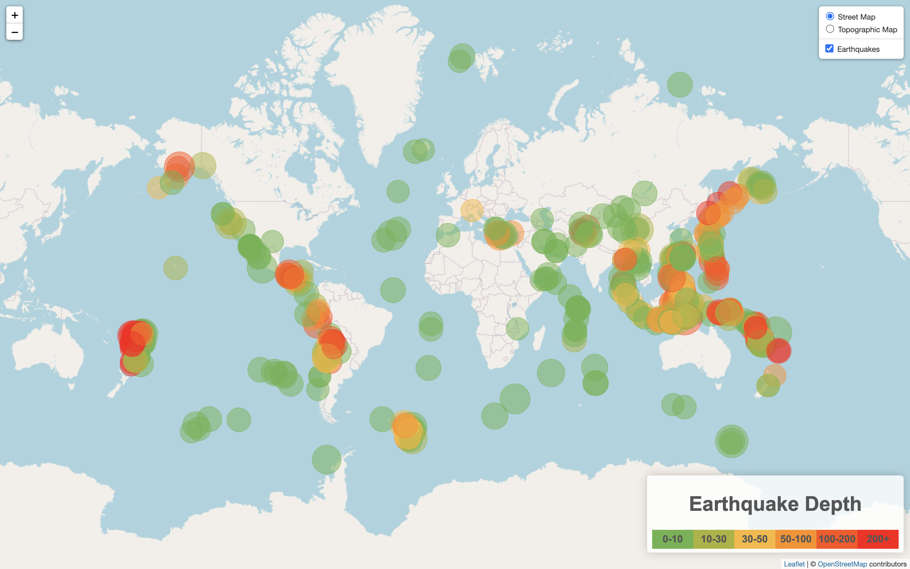
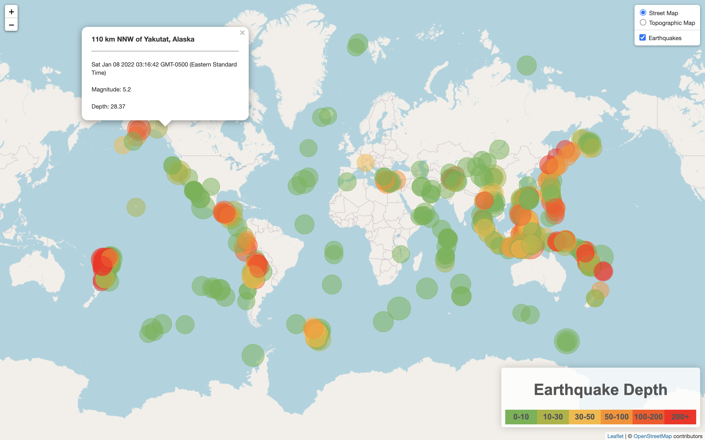
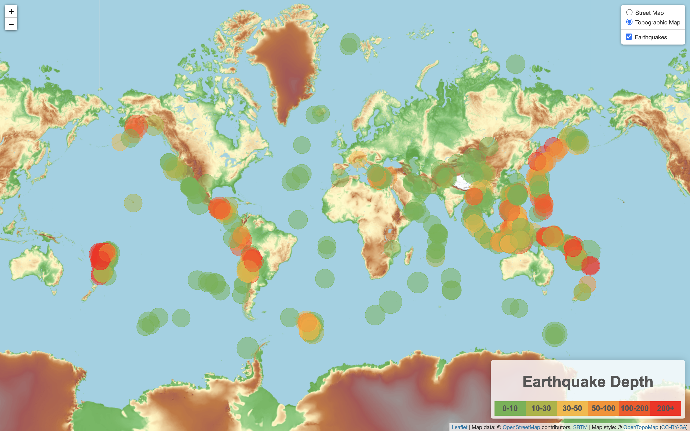
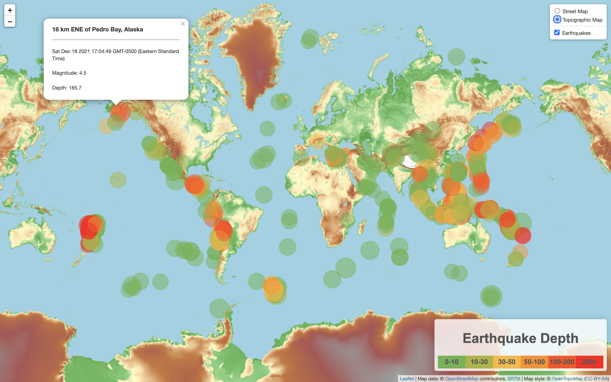

### Earthquake-Mapping
#### <i> Visualization of earthquake data</i>

----------------------

**Description:**

As a new member of the United States Geological Survey (USGS), I have been tasked with building an map that allows the team to visualize their earthquake data.

<b>Datasets used:</b>

* [USGS GeoJSON Feed](https://earthquake.usgs.gov/earthquakes/feed/v1.0/geojson.php)

### Tools used:
----------------------

  - Javascript
  - HTML
  - CSS
  - D3.json
  - Leaflet

###  Data Visualization:
----------------------

#### Web Page Screenshots

Street Map:

Street Map with Pop-up:

Topographic Map:

Topographic Map with Pop-up:

